# Hyperlane Cardano Guide

This document is the consolidated reference for the Hyperlane-Cardano integration. It covers architecture, message flows, NFT patterns, recipient development, warp routes, IGP, validator operations, E2E testing, and integration status.

## Table of Contents

1. [Architecture Overview](#1-architecture-overview)
2. [Message Flows](#2-message-flows)
3. [NFT Patterns](#3-nft-patterns)
4. [Reference Scripts](#4-reference-scripts)
5. [Recipients](#5-recipients)
6. [Warp Routes](#6-warp-routes)
7. [Interchain Gas Paymaster (IGP)](#7-interchain-gas-paymaster-igp)
8. [Validator Operations](#8-validator-operations)
9. [Fuji E2E Testing](#9-fuji-e2e-testing)
10. [Known Limitations](#10-known-limitations)
11. [Integration Status](#11-integration-status)
12. [Future Optimizations](#12-future-optimizations)

---

## 1. Architecture Overview

Hyperlane is an interchain messaging protocol that enables applications to send arbitrary messages between blockchains. The Cardano integration adapts the protocol to Cardano's eUTXO model.

### Design Principles

1. **Relayer-driven**: The Hyperlane relayer constructs and submits all Cardano transactions
2. **eUTXO-compatible**: All state is managed through UTXOs with inline datums
3. **NFT-based identity**: State UTXOs are identified by unique NFTs rather than addresses
4. **Reference scripts**: Validators are stored as reference scripts to minimize transaction size

### Contract Dependency Graph

The arrows represent "checks that X is spent" relationships, not invocations:

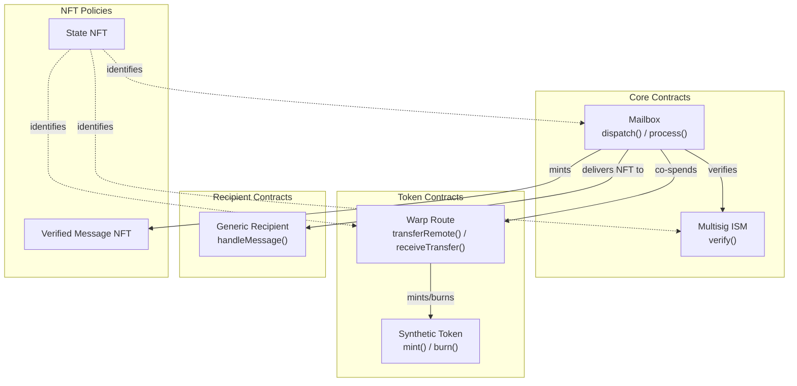

The relayer resolves warp routes (`0x01`) via O(1) NFT queries using the state NFT policy. Generic recipients (`0x02`) are resolved by script hash address. No registry contract is needed.

### Cross-Contract Coordination in eUTXO

Unlike account-based chains (EVM, Solana), Cardano does not support cross-contract calls. All contracts in a transaction validate **independently and simultaneously** against the same transaction context.

Cross-contract coordination uses **mutual spending validation**: each contract checks that the other contracts it depends on are being spent in the same transaction.

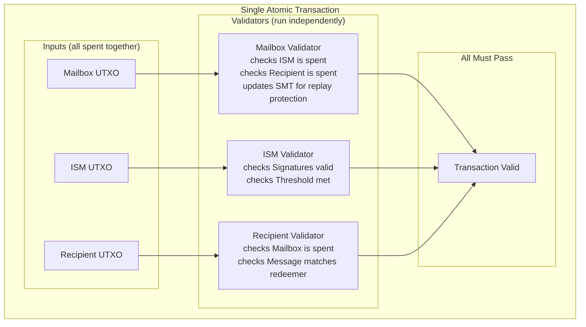

**How each contract ensures correctness:**

- **Mailbox** ensures the **trusted ISM** verifies **this specific message**: it checks that an input with the exact script hash stored in `datum.default_ism` is being spent, then inspects that input's redeemer to confirm the checkpoint's `message_id` matches the expected one. This prevents both untrusted ISM attacks and signature replay.

- **Recipient** ensures the message came from the mailbox by checking that the mailbox UTXO (identified by its state NFT) is being spent in the same transaction.

In Cardano, all contracts validate the same transaction simultaneously. There is no control flow between contracts. Coordination is via "I see you're being spent, so I know your rules passed."

### Domain and Address Encoding

Cardano uses 28-byte identifiers (script hashes and policy IDs) padded to 32 bytes for Hyperlane compatibility. Two prefix types distinguish the identifier kind:

| Prefix | Meaning | Used By |
|--------|---------|---------|
| `0x01000000` | NFT minting policy ID | Warp routes |
| `0x02000000` | Script hash credential | Generic recipients, mailbox, ISM |

```
State NFT Policy ID:        0xabcdef1234567890... (28 bytes)
Hyperlane Address (NFT):    0x01000000abcdef1234567890... (32 bytes)

Generic Recipient Hash:     0x7fb8e3ae915c4c37... (28 bytes)
Hyperlane Address (script): 0x020000007fb8e3ae915c4c37... (32 bytes)
```

The mailbox's `verified_message_nft` minting/delivery is **conditional on the prefix**: only `0x02` recipients get verified message NFTs. Warp routes (`0x01`) validate independently by checking the mailbox is co-spending.

### Domain IDs

| Chain            | Domain ID |
|------------------|-----------|
| Cardano Preview  | 2003      |
| Cardano Preprod  | 2002      |
| Cardano Mainnet  | 2001      |
| Fuji (Avalanche) | 43113     |
| Ethereum Mainnet | 1         |
| Ethereum Sepolia | 11155111  |

---

## 2. Message Flows

### Incoming Messages (Other Chains -> Cardano)

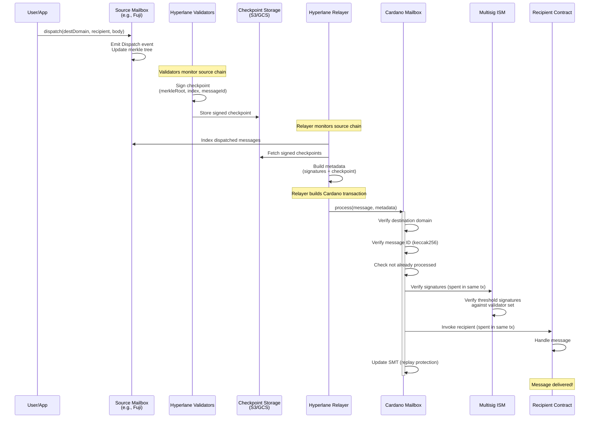

The process transaction structure depends on the recipient type:

#### WarpRoute Recipients (Single TX)

The recipient UTXO is spent in the same transaction. Tokens go directly to the recipient wallet.

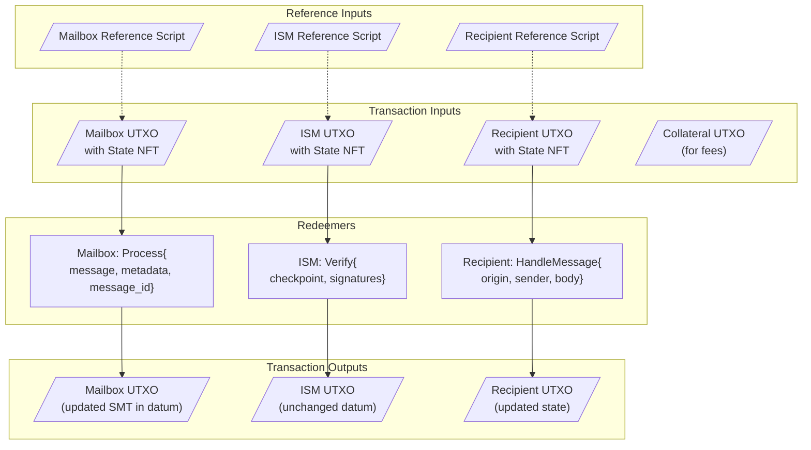

#### Generic Recipients (Two-Phase Verified Message)

The mailbox creates a verified message UTXO at the recipient's script address. The recipient processes it in a separate transaction.

**TX 1: Mailbox Process**

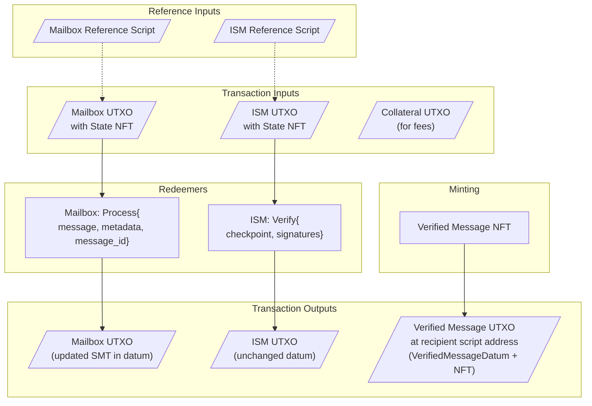

**TX 2: Recipient Handling**

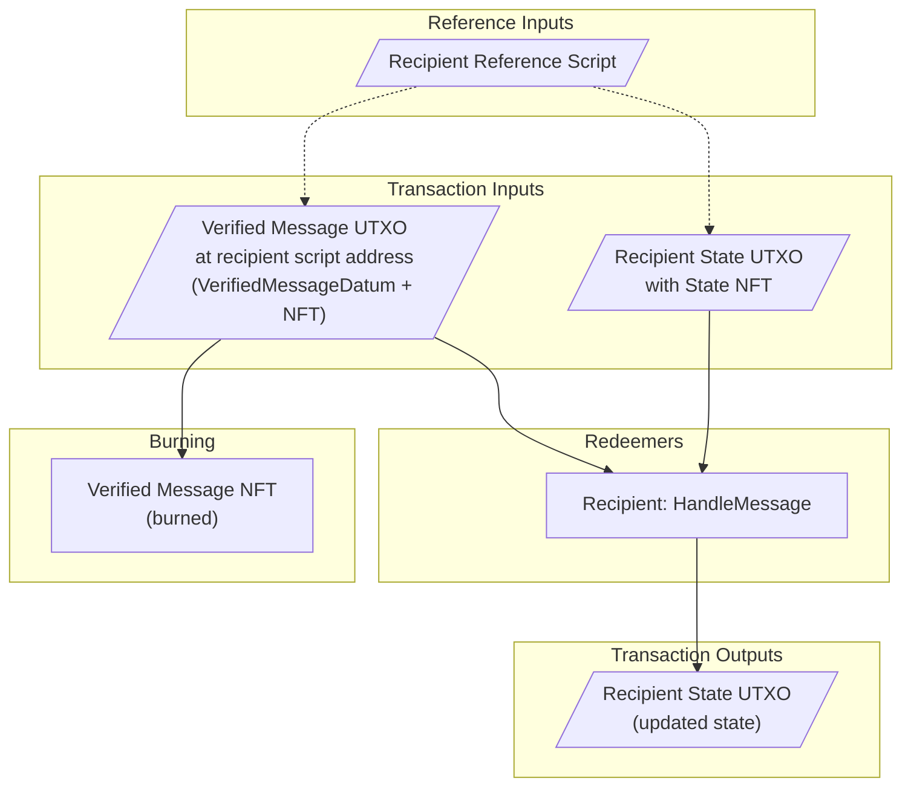

### Outgoing Messages (Cardano -> Other Chains)

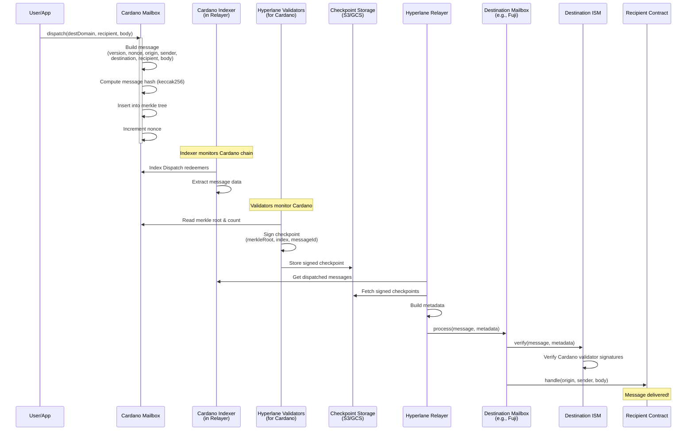

### Dispatch TX Structure

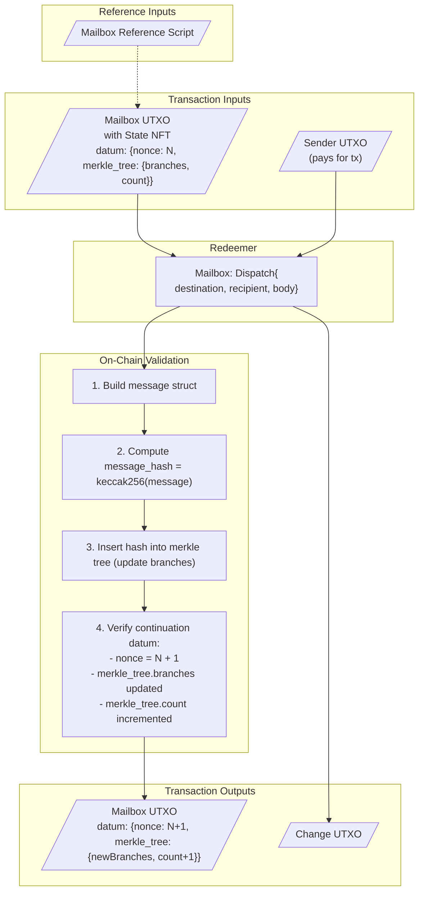

The mailbox stores the full incremental merkle tree state (32 branches x 32 bytes = 1024 bytes) in the datum. This enables proper on-chain merkle validation at the cost of ~4.4 ADA in minUTxO. The fixed-size branch array (32 branches for 2^32 capacity) means storage remains constant regardless of message count.

### Signature Verification Flow

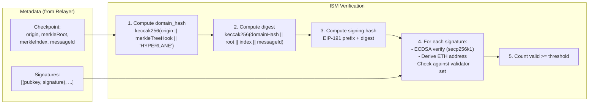

---

## 3. NFT Patterns

Cardano's eUTXO model requires different patterns than account-based chains. NFTs are used extensively to solve several challenges.

### State NFTs (One-Shot, State Thread)

**Problem**: UTXOs at a script address are not uniquely identifiable by address alone.

**Solution**: Each contract's state UTXO contains a unique "state NFT" combining two well-known Cardano patterns:

- [One-Shot Minting Policy](https://aiken-lang.org/fundamentals/common-design-patterns#one-shot-minting-policies): The NFT can only be minted once (parameterized by a UTXO that must be consumed)
- [State Thread Token](https://aiken-lang.org/fundamentals/common-design-patterns#state-thread-token): The NFT identifies the "current" state UTXO as it moves through transactions

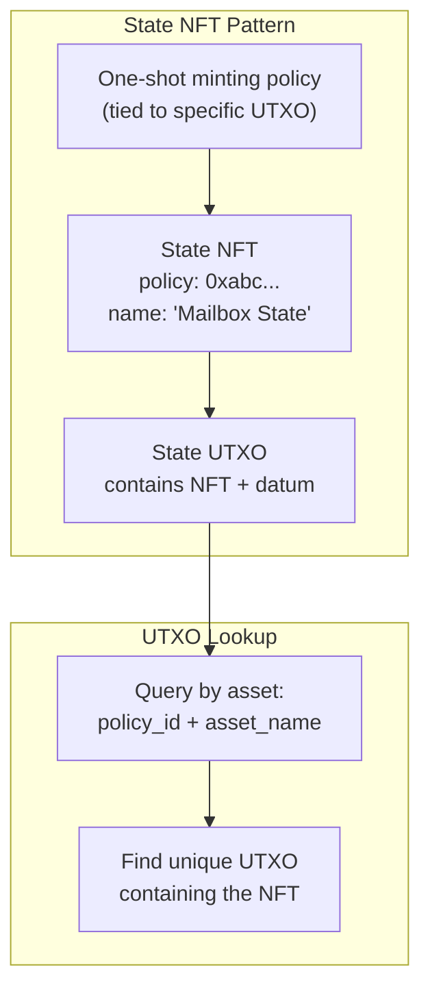

**Contracts using State NFTs:**

| Contract | NFT Purpose |
|----------|-------------|
| Mailbox | Identifies the single mailbox state UTXO |
| ISM | Identifies the ISM configuration UTXO |
| Warp Route | Identifies each warp route's state UTXO |
| Recipients | Each registered recipient has a state NFT |

### Replay Protection (Sparse Merkle Tree)

**Problem**: Prevent the same message from being processed twice.

**Solution**: The mailbox datum contains a Sparse Merkle Tree (SMT) that tracks processed message IDs. During `process()`, the mailbox inserts the message ID into the SMT and verifies it was not already present.

**On-chain**: The mailbox validator checks the SMT non-membership proof for the message ID before processing and verifies the continuation datum contains the updated SMT with the new member inserted.

**Off-chain (relayer)**: The relayer initializes the SMT by scanning all mailbox address transactions via Blockfrost and parsing Process redeemers to extract delivered message IDs. The `delivered()` check is an in-memory SMT lookup with no network calls.

**Key properties:**

- All replay protection state is in the mailbox datum (no separate UTXOs or NFTs)
- O(1) in-memory delivery check in the relayer
- No on-chain queries needed for delivery status

### Verified Message NFTs (Two-Phase Delivery)

**Problem**: Generic recipients (scripts) cannot be invoked by the mailbox directly. We need a way to prove that a message was validated by the mailbox so the recipient can process it later.

**Solution**: During mailbox `process()`, the mailbox mints a "verified message NFT" and creates a UTXO at the recipient's script address containing the NFT and a `VerifiedMessageDatum`. The recipient processes this UTXO in a separate transaction, burning the NFT.

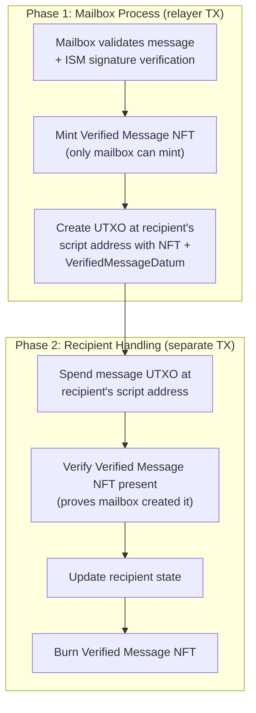

**Security Properties:**

- Only mailbox can mint the NFT (parameterized minting policy)
- NFT presence proves message authenticity
- Burning prevents double-processing

### Synthetic Tokens

Warp routes mint/burn synthetic tokens representing assets from other chains. The `synthetic_token.ak` minting policy is parameterized with the warp route NFT policy -- only the warp route can authorize minting/burning.

### NFT Summary Table

| NFT Type              | Purpose                      | Minting Policy          | When Minted                                  | When Burned                    |
|-----------------------|------------------------------|-------------------------|----------------------------------------------|--------------------------------|
| State NFT             | Identify state UTXOs         | One-shot (tied to UTXO) | Contract deployment                          | Never                          |
| Verified Message NFT  | Message authentication       | Mailbox-controlled      | Message processing (generic recipients only) | Message handling by recipient  |
| Synthetic Token       | Bridged token representation | Warp route-controlled   | Token receive                                | Token send                     |

---

## 4. Reference Scripts

### Problem

When spending a script UTXO, the transaction needs access to the validator code. Including the full script in every transaction is expensive. Reference scripts allow pointing to a UTXO that contains the script, minimizing transaction size.

### Two-UTXO Pattern

Separate the state UTXO from the reference script UTXO:

```
Reference Script UTXO (never spent)
  Address: deployer address
  Value: ~20-30 ADA + NFT(policy, "ref")
  Datum: None
  Reference Script: <validator code>     <-- Script lives here

Recipient State UTXO (spent on handle)
  Address: script address
  Value: ~2 ADA + NFT(policy, "state")
  Datum: { contract state... }
  Reference Script: None
```

Advantages: state UTXO is smaller (less locked ADA), reference script UTXO is immutable and stable. This is the standard pattern used by all Hyperlane Cardano contracts.

### Configuration-Based Discovery

Reference scripts are resolved without any on-chain registry:

- **Core contracts** (mailbox, ISM): Reference script UTXOs configured in the relayer's `ConnectionConf` (e.g., `mailbox_reference_script_utxo`, `ism_reference_script_utxo`)
- **Warp routes**: A shared reference script UTXO configured via `warp_route_reference_script_utxo`. All warp route instances of the same validator share the same reference script.

### Deployment

When deploying a warp route, the deployment transaction produces two outputs:

- **Output #0**: State UTXO at the script address (state NFT + datum)
- **Output #1**: Reference script UTXO (reference script NFT with asset name `726566` = "ref" in hex + validator code)

The reference script NFT uses the same minting policy as the state NFT but with asset name `726566`. This UTXO is never spent.

### Relayer UTXO Discovery Flow

```
Message arrives: { recipient: 0x01...{nft_policy} or 0x02...{script_hash} }
  |
  v
1. Resolve recipient from address prefix
   0x01: Warp route -- extract NFT policy, query state UTXO by NFT
   0x02: Generic recipient -- extract script hash, query UTXOs at script address
  |
  v
2. Discover state UTXO by NFT query
   Query: UTXO containing NFT(nft_policy)
   Read datum for config, ISM, etc.
  |
  v
3. Load reference script UTXOs from config
   mailbox_reference_script_utxo, ism_reference_script_utxo, etc.
  |
  v
4. Build transaction
   Reference Inputs (read-only): reference script UTXOs
   Script Inputs (spent): mailbox UTXO, ISM UTXO, recipient state UTXO
   Outputs: continuations (mailbox with updated SMT, ISM unchanged)
  |
  v
5. Sign and submit (retry on contention)
```

| Component                   | Discovery Method                          | Purpose                                  |
|-----------------------------|-------------------------------------------|------------------------------------------|
| Recipient state UTXO        | NFT query from recipient address          | Find recipient's current state and datum |
| Mailbox reference script    | `mailbox_reference_script_utxo` config    | Mailbox validator code                   |
| ISM reference script        | `ism_reference_script_utxo` config        | ISM validator code                       |
| Warp route reference script | `warp_route_reference_script_utxo` config | Warp route validator code                |

---

## 5. Recipients

### Contract Pattern

On Cardano, Hyperlane recipients are Plutus V3 scripts that receive cross-chain messages from the Mailbox. The relayer handles message discovery, ISM verification, transaction building, and submission.

#### Datum Structure

The `HyperlaneRecipientDatum` wrapper is available for recipients that need custom ISM support or nonce tracking:

```aiken
type HyperlaneRecipientDatum<inner> {
  ism: Option<ScriptHash>,
  last_processed_nonce: Option<Int>,
  inner: inner,
}
```

Simpler recipients (like `greeting.ak`) can define their own datum type directly.

#### Redeemer Structure

```aiken
type HyperlaneRecipientRedeemer<contract_redeemer> {
  HandleMessage { message: Message, message_id: ByteArray }
  ContractAction { action: contract_redeemer }
}
```

The `message_id` is what the ISM validated. Recipients **must** verify `keccak256(encode_message(message)) == message_id` to ensure message content authenticity.

### Greeting Example

The reference implementation is `greeting.ak`. Generic recipients are parameterized by `verified_message_nft_policy` and `owner`, and handle two types of UTXOs at their script address: **state UTXOs** (with the contract's datum) and **message UTXOs** (with a `verified_message_nft`, no typed datum).

```aiken
use types.{Message, PolicyId, encode_message}

type GreetingDatum {
  last_greeting: ByteArray,
  greeting_count: Int,
}

type GreetingRedeemer {
  Init
  HandleMessage { message: Message, message_id: ByteArray }
  Reclaim
}

validator greeting(verified_message_nft_policy: PolicyId, owner: VerificationKeyHash) {
  spend(
    datum: Option<Data>,
    redeemer: GreetingRedeemer,
    own_ref: OutputReference,
    tx: Transaction,
  ) {
    expect Some(own_input) = find_input(tx, own_ref)

    when redeemer is {
      Init -> list.has(tx.extra_signatories, owner) && is_ada_only(own_input)
      Reclaim -> list.has(tx.extra_signatories, owner) && is_ada_only(own_input)
      HandleMessage { message, message_id } -> {
        // Message UTXO (holds verified_message_nft): just check burn
        // State UTXO (holds greeting state NFT): full message processing
        let is_message_utxo = quantity_of(own_input, verified_message_nft_policy, message_id) == 1

        if is_message_utxo {
          verified_nft_burned(tx, verified_message_nft_policy, message_id)
        } else {
          expect Some(raw_datum) = datum
          expect old_datum: GreetingDatum = raw_datum
          let greeting = bytearray.concat("Hello, ", message.body)
          // ... verify continuation datum, NFT burn, message UTXO spent
          new_datum.last_greeting == greeting
            && new_datum.greeting_count == old_datum.greeting_count + 1
        }
      }
    }
  }

  else(_) { fail }
}
```

Key points:
- `HandleMessage` carries the full `Message` and `message_id`
- Verifies `keccak256(encode_message(message)) == message_id`
- The `verified_message_nft` burn proves the mailbox created the message
- `Init` and `Reclaim` redeemers require owner signature and ADA-only input
- The `None` datum branch handles the message UTXO (no contract-specific datum)

### State UTXO Pattern

Recipients must have a **state UTXO** at the script address containing an NFT marker for unique identification and contract state in an inline datum. The relayer uses this NFT to find the state UTXO.

### Addressing (`0x01` vs `0x02`)

**Warp routes** use NFT-policy addressing (`0x01` prefix):
- Hyperlane address = `0x01000000{state_nft_policy_id}` (32 bytes)
- Relayer discovers via O(1) NFT query
- Spent in the same TX as the mailbox (TokenReceiver)

**Generic recipients** use script-hash addressing (`0x02` prefix):
- Hyperlane address = `0x02000000{script_hash}` (32 bytes)
- Relayer discovers by querying UTXOs at the script address
- Uses two-phase verified message delivery

No registration transaction is needed on either side. Remote chains enroll the appropriate address format.

### Two-Phase Message Delivery (Verified Message Pattern)

This is the **default pattern** for generic (non-WarpRoute) recipients:

- **Phase 1 (Process TX)**: The mailbox mints a `verified_message_nft` and creates a UTXO at the recipient's script address containing the NFT and a `VerifiedMessageDatum`.
- **Phase 2 (Receive TX)**: Anyone spends the message UTXO together with the recipient's state UTXO, burning the NFT and updating the recipient state.

This pattern exists because the relayer cannot know how to build arbitrary recipient outputs.

#### VerifiedMessageDatum

```aiken
type VerifiedMessageDatum {
  origin: Domain,
  sender: HyperlaneAddress,
  body: ByteArray,
  message_id: ByteArray,
  nonce: Int,
}
```

#### The verified_message_nft Minting Policy

Parameterized by the mailbox policy ID. Only allows minting when the mailbox NFT is present in the transaction inputs (proving ISM verification occurred). Burning is always allowed for 32-byte asset names with negative quantities.

### Canonical Config NFT (Per-Recipient ISM Override)

The `canonical_config_nft.ak` policy enables per-recipient ISM override configuration. It is a fixed (non-parameterized) policy whose ID is a protocol constant. The asset name of the minted token is the recipient's script hash (28 bytes), allowing the relayer to derive the config token for any `0x02 + script_hash` recipient without per-recipient pre-configuration.

Minting is only allowed when a spent input at the recipient's script address carries a constructor-0 redeemer (the `Init` tag), ensuring only the legitimate contract owner can mint the config token.

### Deployment

#### Using the CLI (Recommended)

```bash
BLOCKFROST_API_KEY=your_api_key ./cli/target/release/hyperlane-cardano \
  --signing-key path/to/payment.skey \
  --network preview \
  init recipient \
  --custom-contracts ./contracts \
  --custom-module greeting \
  --custom-validator greeting
```

The CLI handles parameterization, NFT minting, and initial state creation. Output includes recipient script hash, state NFT policy ID, recipient script address, and TX hash. The `verified_message_nft_policy` is auto-derived from the mailbox deployment.

See the [DEPLOYMENT_GUIDE.md](./DEPLOYMENT_GUIDE.md) for full step-by-step instructions.

### Operating a Recipient

#### List Pending Messages

```bash
hyperlane-cardano message list \
  --recipient-address addr_test1wz...
```

#### Receive a Message

```bash
# Dry run first
hyperlane-cardano message receive \
  --message-utxo "txhash#0" \
  --recipient-policy def456... \
  --dry-run

# Submit
hyperlane-cardano message receive \
  --message-utxo "txhash#0" \
  --recipient-policy def456...
```

Parameters: `--message-utxo`, `--recipient-policy`, `--recipient-state-asset`, `--message-nft-policy` (auto-derived from mailbox deployment), `--recipient-ref-script`, `--nft-ref-script`, `--dry-run`.

#### Automated Processing

```bash
#!/bin/bash
MESSAGES=$(hyperlane-cardano message list \
  --recipient-address $RECIPIENT_ADDRESS --format json)

echo "$MESSAGES" | jq -r '.[].utxo' | while read UTXO; do
  hyperlane-cardano message receive \
    --message-utxo "$UTXO" \
    --recipient-policy $STATE_POLICY \
    --recipient-ref-script "$RECIPIENT_REF" \
    --nft-ref-script "$NFT_REF"
  sleep 30  # Avoid contention
done
```

### Security Considerations

**Generic recipients**: Verify the `verified_message_nft` is being burned (proves ISM validation):

```aiken
expect keccak_256(encode_message(message)) == message_id
expect verified_nft_burned(tx, verified_message_nft_policy, message_id)
expect message_utxo_spent(tx, own_addr, verified_message_nft_policy, message_id, own_ref)
```

**WarpRoute recipients**: Verify the mailbox script is co-spending:

```aiken
expect has_script_input(tx, mailbox_hash)
```

Both patterns ensure the message was validated by the ISM. Replay protection is handled by the mailbox's Sparse Merkle Tree.

**Validate origin and sender** for access control:

```aiken
expect origin == 1  // Only accept from Ethereum
expect sender == expected_sender  // Only accept from trusted contract
```

---

## 6. Warp Routes

Warp routes enable cross-chain token transfers through Hyperlane's messaging protocol.

### Types

| Type           | Use Case                                     | Mechanism                                              |
|----------------|----------------------------------------------|--------------------------------------------------------|
| **Native**     | Bridge ADA to other chains                   | Lock ADA in state UTXO on send, release on receive     |
| **Collateral** | Bridge Cardano native tokens to other chains | Lock tokens in state UTXO on send, release on receive  |
| **Synthetic**  | Receive tokens from other chains on Cardano  | Mint synthetic tokens on receive, burn on send          |

Both Native ADA and Collateral tokens are locked directly in the warp route state UTXO (no separate vault contract).

### Deploy

```bash
# Native (ADA)
hyperlane-cardano warp deploy --token-type native --decimals 6 \
  --signing-key ./testnet-keys/payment.skey --contracts-dir ./contracts

# Collateral
hyperlane-cardano warp deploy --token-type collateral \
  --token-policy <POLICY_ID> --token-asset <ASSET_NAME> --decimals 6 \
  --signing-key ./testnet-keys/payment.skey --contracts-dir ./contracts

# Synthetic
hyperlane-cardano warp deploy --token-type synthetic --decimals 6 \
  --remote-decimals 18 \
  --signing-key ./testnet-keys/payment.skey --contracts-dir ./contracts
```

### Enroll Remote Router

```bash
hyperlane-cardano warp enroll-router \
  --warp-policy <WARP_NFT_POLICY> \
  --domain 43113 \
  --router 0x<REMOTE_ROUTER_PADDED_TO_32_BYTES> \
  --signing-key ./testnet-keys/payment.skey --contracts-dir ./contracts
```

### Transfer Tokens (Outbound)

```bash
hyperlane-cardano warp transfer \
  --warp-policy <WARP_NFT_POLICY> \
  --domain 43113 \
  --recipient 0x<REMOTE_RECIPIENT> \
  --amount 1000000 \
  --signing-key ./testnet-keys/payment.skey --contracts-dir ./contracts
```

Amount is in the smallest unit (lovelace for ADA).

### Common Operations

```bash
# View configuration
hyperlane-cardano warp show --warp-policy <WARP_NFT_POLICY>

# List enrolled routers
hyperlane-cardano warp routers --warp-policy <WARP_NFT_POLICY>
```

### Architecture

#### UTXO Structure

Each warp route creates two UTXOs at deployment:

```
State UTXO (at warp route address) - ALL types
  Location: addr_test1wz...
  Value: 2,000,000+ lovelace + locked tokens*
  NFT: {nft_policy}."" (empty asset name)
  Datum: WarpRouteState { ... }
  * Native: holds locked ADA
  * Collateral: holds locked tokens
  * Synthetic: only MIN_UTXO lovelace

Reference Script UTXO (at deployer address) - ALL types
  Location: addr_test1qz... (deployer)
  Value: ~15,000,000 lovelace
  NFT: {nft_policy}.726566 ("ref")
  Script: warp_route validator

Minting Ref UTXO (for Synthetic routes only)
  Location: addr_test1qz... (deployer)
  NFT: {nft_policy}.6d696e745f726566 ("mint_ref")
  Script: synthetic_minting_policy
```

#### Datum Structure

```
WarpRouteDatum {
  config: WarpRouteConfig {
    token_type: Collateral | Synthetic | Native,
    decimals: Int,
    remote_routes: List<(Domain, RouterAddress)>
  },
  owner: VerificationKeyHash,
  total_bridged: Int,
  ism: Option<ScriptHash>
}
```

| Type       | Constructor | Fields                                     |
|------------|-------------|-------------------------------------------|
| Collateral | 0           | `policy_id`, `asset_name`                  |
| Synthetic  | 1           | `minting_policy`                           |
| Native     | 2           | (none)                                     |

#### Transfer Flows

**Native ADA:**

```
Outbound (Cardano -> Remote):
  User sends ADA -> locked in warp route state UTXO -> mailbox dispatch -> remote mints wADA

Inbound (Remote -> Cardano):
  Remote burns wADA -> message to Cardano -> warp route releases ADA -> user receives ADA
```

**Collateral:**

```
Outbound (Cardano -> Remote):
  User locks tokens in state UTXO -> mailbox dispatch -> remote mints wrapped tokens

Inbound (Remote -> Cardano):
  Remote burns wrapped tokens -> message to Cardano -> warp route releases tokens -> user receives tokens
```

**Synthetic:**

```
Inbound (Remote -> Cardano):
  Remote locks/burns tokens -> message to Cardano -> warp route mints synthetic tokens -> user receives tokens

Outbound (Cardano -> Remote):
  User burns synthetic tokens -> mailbox dispatch -> remote releases original tokens
```

#### Decimal Conversion

| Asset  | Cardano Decimals | EVM Decimals | Conversion Factor |
|--------|-----------------|--------------|-------------------|
| ADA    | 6               | 18           | 10^12             |
| HOSKY  | 0               | 18           | 10^18             |
| Custom | Varies          | 18           | 10^(18-local)     |

Wire amount: `wire_amount = local_amount * 10^(remote_decimals - local_decimals)`

---

## 7. Interchain Gas Paymaster (IGP)

### Cardano Gas Cost Model

Cardano transaction costs:

```
cardano_tx_fee = min_fee_a * tx_size_bytes + min_fee_b + script_execution_cost + ref_script_cost
```

Where `min_fee_a` = 44 lovelace/byte, `min_fee_b` = 155,381 lovelace, `ref_script_cost` = 15 lovelace/byte (Conway era).

Costs depend on the **recipient type**:

#### Warp Route Recipients (`0x01`)

No `verified_message` UTXO created.

| Component | Cost |
|-----------|------|
| Script execution fee | ~95,000-133,000 lovelace |
| Base TX skeleton (~8KB) | ~330,000-346,000 lovelace |
| Reference script fee | ~150,000 lovelace |
| Message body in TX | ~44 lovelace/byte |

**Total = ~600,000 fixed + 44 * body_size variable**

#### Script Recipients (`0x02`)

The `verified_message` UTXO stores the full body as inline datum (`coins_per_utxo_byte` = 4,310 lovelace/byte):

| Component | Cost |
|-----------|------|
| Verified-message UTXO | ~1,700,000 + 4,310 * body_size |
| Script execution fee | ~95,000-133,000 lovelace |
| Base TX skeleton | ~330,000-346,000 lovelace |
| Reference script fee | ~150,000 lovelace |
| Message body in TX | ~44 lovelace/byte |

**Total = ~2,300,000 fixed + 4,354 * body_size variable**

### Oracle Configuration

#### Mapping Cardano Costs to EVM IGP

| IGP Parameter | Value | Meaning |
|---------------|-------|---------|
| `gasPrice` | 44 | Cardano's `min_fee_a` (lovelace per byte) |
| `gasOverhead` | 52,000 | Fixed base costs / 44 |
| `gasLimit` | varies | Variable cost passed by caller |
| `tokenExchangeRate` | market-dependent | Converts lovelace to source chain token |

#### EVM IGP (for Cardano destination)

```bash
# StorageGasOracle
cast send $STORAGE_GAS_ORACLE \
  "setRemoteGasDataConfigs((uint32,uint128,uint128)[])" \
  "[(2003, <tokenExchangeRate>, 44)]"

# IGP
cast send $IGP \
  "setDestinationGasConfigs((uint32,(address,uint96))[])" \
  "[(2003, ($STORAGE_GAS_ORACLE, 52000))]"
```

#### Cardano IGP (for EVM destination)

```bash
hyperlane-cardano igp set-oracle \
  --domain 43113 \
  --gas-price 1000000000 \
  --exchange-rate 34 \
  --gas-overhead 100000
```

### Exchange Rate Calibration

Exchange rates must account for decimal differences between chains.

**Cardano -> EVM** (Cardano IGP):

```
exchange_rate = market_rate_ada_per_avax * (1e18 / 1e6) / 1e12
             = market_rate (approximately)
```

**EVM -> Cardano** (EVM IGP):

```
tokenExchangeRate = (1 / market_rate) * (1e6 / 1e18) * 1e10
                  = 1e22 / (market_rate * 1e6)
```

### Understanding gasOverhead

The `gasOverhead` covers **fixed base costs** of delivering a message to Cardano, sized for the worst case (script recipients):

```
gasOverhead = (550,000 + 1,700,000) / 44 = 2,250,000 / 44 ~ 51,136 -> rounded to 52,000
```

The IGP's `quoteDispatch` adds `gasOverhead` to the caller-provided `gasLimit` automatically:

```
totalGas = gasOverhead + gasLimit
quote = totalGas * gasPrice * tokenExchangeRate / TOKEN_EXCHANGE_RATE_SCALE
```

### Dispatching to Cardano from EVM

#### gasLimit Formulas

| Recipient Type | gasLimit Formula | Rationale |
|----------------|-----------------|-----------|
| Warp route (`0x01`) | `body.length` | Only TX size fee at 44 lovelace/byte |
| Script (`0x02`) | `body.length * 99` | `coins_per_utxo_byte` (4,310) / `gasPrice` (44) ~ 99 |

#### Example: Warp Route

```solidity
bytes memory metadata = StandardHookMetadata.overrideGasLimit(body.length);
uint256 fee = mailbox.quoteDispatch(cardanoDomain, recipient, body, metadata);
mailbox.dispatch{value: fee}(cardanoDomain, recipient, body, metadata);
```

#### Example: Script Recipient

```solidity
uint256 gasLimit = body.length * 99;
bytes memory metadata = StandardHookMetadata.overrideGasLimit(gasLimit);
uint256 fee = mailbox.quoteDispatch(cardanoDomain, recipient, body, metadata);
mailbox.dispatch{value: fee}(cardanoDomain, recipient, body, metadata);
```

#### EVM Warp Routes (Automatic)

Warp routes extend `GasRouter`, which stores per-destination `destinationGas` and includes it as metadata automatically:

```solidity
// Owner configures once:
warpRoute.setDestinationGas(2003, 200);

// Users just call:
uint256 fee = warpRoute.quoteGasPayment(2003);
warpRoute.transferRemote{value: fee}(2003, recipient, amount);
```

### Relayer Gas Payment Enforcement

```json
{
  "gasPaymentEnforcement": [
    {
      "type": "onChainFeeQuoting",
      "gasFraction": "1/1"
    }
  ]
}
```

The relayer indexes `PayForGas` transactions from the IGP contract. Messages without sufficient payment are skipped.

### Cost Summary Table

| | Warp Routes (`0x01`) | Script Recipients (`0x02`) |
|---|---|---|
| `verified_message` UTXO | Not created | Stores full body as inline datum |
| Fixed base cost | ~0.6M lovelace | ~2.3M lovelace |
| Per-byte cost | ~44 lovelace/byte | ~4,354 lovelace/byte |
| gasLimit formula | `body.length` | `body.length * 99` |
| 100B total cost | ~0.6 ADA | ~2.7 ADA |
| 5,000B total cost | ~0.8 ADA | ~24.1 ADA |

### Recalibration

Update oracle values when:
- Market exchange rates change >10%
- Cardano protocol parameters change (`min_fee_a`, `coins_per_utxo_byte`)
- EVM destination gas prices change significantly

---

## 8. Validator Operations

A Hyperlane validator monitors the Cardano mailbox for dispatched messages, signs checkpoints proving message inclusion in the merkle tree, and stores these checkpoints for relayers to fetch.

### Prerequisites

1. **Blockfrost API Key** from [blockfrost.io](https://blockfrost.io)
2. **Validator Signing Key** - 32-byte hex-encoded ECDSA private key
3. **Funded Cardano Address** - minimum 3 ADA for on-chain announcement

### Quick Start

```bash
# 1. Generate config
cd cardano
./cli/target/release/hyperlane-cardano config update-validator \
  --validator-key 0x<your-64-char-hex-key> \
  --checkpoint-path ./signatures \
  --db-path /tmp/hyperlane-validator-db

# 2. Set environment
export BLOCKFROST_API_KEY=preview<your-api-key>

# 3. Create checkpoint directory
mkdir -p ./signatures

# 4. Run the validator
cd rust/main
cargo build --release -p validator
export CONFIG_FILES=/path/to/cardano/config/validator-config.json
./target/release/validator
```

### Configuration

#### Command Line Options

| Option | Description | Default |
|--------|-------------|---------|
| `--validator-key` | Validator signing key (hex) | Required |
| `--checkpoint-path` | Checkpoint storage directory | `./signatures` |
| `--db-path` | Validator database path | `/tmp/hyperlane-validator-db` |
| `--metrics-port` | Prometheus metrics port | `9091` |
| `--index-from` | Block to start indexing from | Auto-detected |

#### Environment Variables

| Variable | Description | Required |
|----------|-------------|----------|
| `BLOCKFROST_API_KEY` | Blockfrost API key | Yes |
| `VALIDATOR_HEX_KEY` | Validator signing key (alternative) | No |
| `CONFIG_FILES` | Path(s) to config file(s) | Yes (at runtime) |

#### Config File Structure

```json
{
  "originChainName": "cardanopreview",
  "db": "/tmp/hyperlane-validator-db",
  "interval": 5,
  "validator": {
    "type": "hexKey",
    "key": "0x..."
  },
  "checkpointSyncer": {
    "type": "localStorage",
    "path": "./signatures"
  },
  "chains": {
    "cardanopreview": {
      "name": "cardanopreview",
      "domainId": 2003,
      "protocol": "cardano",
      "connection": { ... }
    }
  }
}
```

### Validator Lifecycle

1. **Startup**: Load configuration, connect to Blockfrost
2. **Announcement Check**: Query ValidatorAnnounce contract
3. **Self-Announce**: If not announced, submit announcement transaction
4. **Wait for Messages**: Poll merkle tree hook until messages exist
5. **Sync Messages**: Index dispatched messages from the mailbox
6. **Sign Checkpoints**: For each new message, sign and store checkpoint
7. **Serve Checkpoints**: Checkpoints available for relayers

### Checkpoint Storage

**Local** (testing):

```json
"checkpointSyncer": {
  "type": "localStorage",
  "path": "./signatures"
}
```

**S3** (production):

```json
"checkpointSyncer": {
  "type": "s3",
  "bucket": "your-bucket-name",
  "region": "us-east-1"
}
```

### Validator Announcement

The validator announces its storage location on-chain so relayers can discover checkpoints. Requires a `signer` configured for the origin chain with sufficient ADA (minimum 3).

S3 URL format: `s3://<bucket>/<region>/<folder>`

```bash
./cli/target/release/hyperlane-cardano \
  --signing-key $CARDANO_SIGNING_KEY --network $NETWORK \
  validator announce --storage-location "s3://your-bucket/your-region/your-folder"
```

### Monitoring

Prometheus metrics on configured port (default 9091):

- `hyperlane_latest_checkpoint` - Latest checkpoint index
- `hyperlane_backfill_complete` - Historical backfill status
- `hyperlane_reached_initial_consistency` - Initial sync status

### Troubleshooting

**Rate limiting**: Blockfrost free tier allows 10 requests/second. Increase `interval` or reduce `maxSignConcurrency`.

**Reorg handling**: Validator includes reorg detection. If detected, it panics with a detailed error. Do NOT force restart -- investigate first.

**"Mailbox not deployed"**: Deploy mailbox first via CLI.

**"Invalid validator key format"**: Key must be 32 bytes (64 hex chars) with `0x` prefix.

### Network-Specific Settings

| Network | Domain ID | Blockfrost URL |
|---------|-----------|----------------|
| Preview | 2003 | https://cardano-preview.blockfrost.io/api/v0 |
| Preprod | 2002 | https://cardano-preprod.blockfrost.io/api/v0 |
| Mainnet | 2001 | https://cardano-mainnet.blockfrost.io/api/v0 |

---

## 9. Fuji E2E Testing

This section provides step-by-step instructions for deploying Hyperlane warp route infrastructure on Avalanche Fuji testnet for E2E testing with Cardano.

### Prerequisites

1. **Foundry** installed: `curl -L https://foundry.paradigm.xyz | bash && foundryup`
2. **Test AVAX** from [Avalanche Fuji Faucet](https://faucet.avax.network/) (at least 1 AVAX)
3. **Base environment variables**:

```bash
export FUJI_RPC_URL="https://api.avax-test.network/ext/bc/C/rpc"
export FUJI_SIGNER_KEY="0x..."
export FUJI_MAILBOX="0x5b6CFf85442B851A8e6eaBd2A4E4507B5135B3B0"
export CARDANO_DOMAIN=2003
export FUJI_DOMAIN=43113
```

### Deployment Flow

```
Step 1: Deploy ISM ----------------> FUJI_CARDANO_ISM
Step 2: Deploy Warp Routes --------> FUJI_SYNTHETIC_*, FUJI_COLLATERAL_*, etc.
Step 3: Set ISM on Routes
Step 4: Mint Test Tokens
Step 5: Pre-deposit Collateral
Step 6: Enroll Cardano Routers <---- CARDANO_NATIVE_ADA, CARDANO_COLLATERAL_*, etc.
```

### Step 1: Deploy Cardano MultisigISM on Fuji

The ISM validates messages from Cardano. Get the Cardano validator's EVM address:

```bash
# Derive from validator ECDSA key
export CARDANO_VALIDATOR=$(cast wallet address --private-key $CARDANO_VALIDATOR_KEY)

# Deploy
cd solidity
forge script script/warp-e2e/DeployCardanoISM.s.sol:DeployCardanoISM \
  --rpc-url $FUJI_RPC_URL --broadcast --private-key $FUJI_SIGNER_KEY

export FUJI_CARDANO_ISM="0x..."  # from output
```

### Step 2: Deploy Fuji Warp Routes

```bash
cd solidity
forge script script/warp-e2e/DeployFujiWarp.s.sol:DeployFujiWarp \
  --rpc-url $FUJI_RPC_URL --broadcast --private-key $FUJI_SIGNER_KEY
```

Deploys: TestERC20s (FTEST, WADA, TOKA), HypERC20 synthetics (wCTEST, wADA), HypERC20Collateral (FTEST, WADA), HypNative (AVAX).

Save all output addresses as environment variables.

### Step 3: Set ISM on Warp Routes

```bash
cd solidity
forge script script/warp-e2e/DeployCardanoISM.s.sol:DeployCardanoISM \
  --sig "setISMOnWarpRoutes()" \
  --rpc-url $FUJI_RPC_URL --broadcast --private-key $FUJI_SIGNER_KEY
```

### Step 4: Mint Test Tokens

```bash
cd solidity
forge script script/warp-e2e/DeployFujiWarp.s.sol:DeployFujiWarp \
  --sig "mintTestTokens()" \
  --rpc-url $FUJI_RPC_URL --broadcast --private-key $FUJI_SIGNER_KEY
```

### Step 5: Pre-deposit Collateral

For collateral routes that release tokens (e.g., WADA when receiving ADA from Cardano):

```bash
cd solidity
forge script script/warp-e2e/DeployFujiWarp.s.sol:DeployFujiWarp \
  --sig "preDepositCollateral()" \
  --rpc-url $FUJI_RPC_URL --broadcast --private-key $FUJI_SIGNER_KEY
```

### Step 6: Enroll Cardano Routers on Fuji

Get Cardano warp route addresses from deployment (format: `0x01000000{nft_policy_id}`):

```bash
export CARDANO_NATIVE_ADA="0x01000000..."
export CARDANO_COLLATERAL_CTEST="0x01000000..."
export CARDANO_SYNTHETIC_FTEST="0x01000000..."

cd solidity
forge script script/warp-e2e/EnrollCardanoRouters.s.sol:EnrollCardanoRouters \
  --rpc-url $FUJI_RPC_URL --broadcast --private-key $FUJI_SIGNER_KEY
```

### Test Scenarios

| Scenario | Cardano Route    | Fuji Route       | Direction      | Token Flow               |
|----------|------------------|------------------|----------------|--------------------------|
| 1        | Collateral CTEST | Synthetic wCTEST | Cardano -> Fuji | Lock CTEST -> Mint wCTEST |
| 2        | Synthetic wFTEST | Collateral FTEST | Fuji -> Cardano | Lock FTEST -> Mint wFTEST |
| 3        | Native ADA       | Synthetic wADA   | Cardano -> Fuji | Lock ADA -> Mint wADA     |
| 4        | Synthetic wAVAX  | Native AVAX      | Fuji -> Cardano | Lock AVAX -> Mint wAVAX   |
| 5        | Native ADA       | Collateral WADA  | Cardano -> Fuji | Lock ADA -> Release WADA  |

### Test Transfer (Fuji -> Cardano)

```bash
# Approve
cast send $FUJI_FTEST "approve(address,uint256)" $FUJI_COLLATERAL_FTEST "1000000000000000000000" \
  --rpc-url $FUJI_RPC_URL --private-key $FUJI_SIGNER_KEY

# Transfer
cast send $FUJI_COLLATERAL_FTEST "transferRemote(uint32,bytes32,uint256)" \
  $CARDANO_DOMAIN $CARDANO_RECIPIENT "5000000000000000000" \
  --rpc-url $FUJI_RPC_URL --private-key $FUJI_SIGNER_KEY
```

### Verification

```bash
# Check ISM on warp route
cast call $FUJI_SYNTHETIC_WCTEST "interchainSecurityModule()(address)" --rpc-url $FUJI_RPC_URL

# Check enrolled router
cast call $FUJI_SYNTHETIC_WCTEST "routers(uint32)(bytes32)" $CARDANO_DOMAIN --rpc-url $FUJI_RPC_URL

# Check token balance
cast call $FUJI_FTEST "balanceOf(address)(uint256)" $WALLET --rpc-url $FUJI_RPC_URL
```

### Troubleshooting

- **"Environment variable not set"**: Use `export` (not just assignment)
- **"Execution reverted"**: Check ISM is set, router is enrolled, tokens are approved
- **"Insufficient balance"**: Pre-deposit more tokens to collateral contracts
- **Message not delivered**: Verify relayer is running, check Hyperlane Explorer

---

## 10. Known Limitations

### Contract Upgradeability

Cardano contracts are **not upgradeable** after deployment. Any code change to a validator results in a different script hash (different address). The state UTXO locked at the old address cannot be spent by the new validator.

```
Validator Code -> Script Hash -> Address
     | (any change)
New Validator Code -> Different Script Hash -> Different Address
-> Cannot spend old UTXO with new validator
```

**What is preserved across deployments:**

| Component                       | Stability     | Notes                                |
|---------------------------------|---------------|--------------------------------------|
| `mailbox_policy_id` (state NFT) | Fixed at init | Determined by seed UTXO              |
| `mailbox_script_hash`           | **Changes**   | Hash of validator code               |
| Mailbox address                 | **Changes**   | Derived from script hash             |
| Merkle tree state               | **Lost**      | Locked at old address                |
| SMT (replay protection)         | **Lost**      | Locked at old address                |
| Pending messages                | **Orphaned**  | Cannot be relayed                    |

**Implications:**

1. Thorough testing before mainnet is critical
2. New deployment = new identity (all connected chains must reconfigure)
3. Message continuity breaks on redeployment

**Potential future solutions:** migration redeemer, proxy pattern, governance mechanism.

### UTXO Contention (Sequential Message Processing)

#### Incoming Messages

Processing a message requires spending multiple UTXOs (mailbox, ISM, recipient) in a single transaction. Each UTXO can only be spent once per block:

```
Block N:   Message 1 spends Mailbox v1 -> creates Mailbox v2
Block N+1: Message 2 spends Mailbox v2 -> creates Mailbox v3
```

Maximum throughput: ~1 message per block (~3 messages/minute). Messages to different recipients are still sequential due to mailbox contention.

#### Outgoing Messages

Dispatch has similar contention: each dispatch increments the nonce and updates the merkle tree.

#### Mitigation

- Current: retry with backoff, sequential processing with queue management
- Future: convert Mailbox and ISM to minting policies (see [Section 12](#12-future-optimizations))

The limitation becomes relevant when sustained volume exceeds ~100/hour or low-latency delivery is required. For most initial deployments, it is acceptable.

---

## 11. Integration Status

### Component Status

| Component                               | Status         | Notes                                        |
|-----------------------------------------|----------------|----------------------------------------------|
| Incoming Messages (Other -> Cardano)    | Tested         | End-to-end working                           |
| Outgoing Messages (Cardano -> Other)    | Tested         | Validator + relayer delivering               |
| Multisig ISM                            | Complete       | ECDSA secp256k1 verified                     |
| Validator Agent                         | Tested         | Signing checkpoints, storing in S3           |
| Warp Routes (Native, Collateral, Synth) | Tested         | All 6 directions verified                    |
| Interchain Gas Paymaster                | Implemented    | Contract, indexer, and relayer integration   |
| Per-recipient ISM                       | Implemented    | Relayer reads ISM from WarpRouteDatum        |
| NFT Policy Addressing                   | Complete       | O(1) lookups, no registry needed             |

### What's Implemented

**On-Chain (Aiken):**
- Mailbox: full dispatch and process, merkle tree, continuation UTXOs
- Multisig ISM: ECDSA secp256k1 verification (CIP-49), per-origin validator sets
- Verified Message NFTs: message authentication for generic recipients
- Sparse Merkle Tree (SMT): on-chain replay protection in mailbox datum
- Warp Routes: all three types (native, collateral, synthetic)
- IGP: gas oracle, pay-for-gas, claim
- Validator Announce: on-chain announcements

**Off-Chain (Rust):**
- Mailbox: `process()`, `delivered()`, full indexer
- Multisig ISM: `MultisigIsm` trait implementation
- Recipient Resolver: O(1) NFT-based lookups
- Transaction Builder: UTXO selection, reference scripts, fee calculation
- Validator Agent: checkpoint signing, S3 storage

### What's Missing

1. **Reorg Reporter**: Not implemented for Cardano (needed for production hardening)
2. **On-chain Custom ISM Enforcement**: Currently relayer-side only

### Recommended Next Steps

**High Priority (Production):**
1. Security audit (Aiken contracts, signature verification, merkle tree)
2. IGP RPC endpoint and end-to-end testing

**Medium Priority (Hardening):**
3. Cardano-specific reorg detection
4. Monitoring and observability
5. On-chain per-recipient ISM enforcement

**Low Priority (Optimization):**
6. UTXO contention mitigation via minting policies

---

## 12. Future Optimizations

### Parallel Message Processing (Minting Policy Architecture)

**Status:** Design complete, not implemented.

The current architecture creates UTXO contention limiting throughput to ~1 message per block. A future optimization would convert the Mailbox and ISM from spend validators (requiring UTXO spending) to minting policies (requiring only token minting). This eliminates contention on mailbox and ISM UTXOs, as minting policies run without spending any UTXO:

| Scenario | Current | Optimized |
|----------|---------|-----------|
| 10 messages to 10 recipients | ~3.3 min | ~20 sec |
| 10 messages to 1 recipient | ~3.3 min | ~3.3 min |

Contention would remain only on recipient UTXOs (unavoidable -- state must update).

> **Note**: True parallel inbound processing (N messages per block to the same recipient) remains limited by recipient UTXO contention, since the recipient state must update sequentially.

### Dispatch Batching

Batch multiple outgoing dispatches into a single transaction to reduce mailbox UTXO contention. Less critical than incoming optimization since dispatch is user-initiated.

### Reference Script Caching

In-memory cache with TTL for reference scripts, invalidated on UTXO consumption. Avoids repeated Blockfrost fetches.

### Parallel Blockfrost Queries

Use `tokio::try_join!` for independent queries that currently run sequentially.

### Future Features

These are part of the Hyperlane specification but not required for initial Cardano integration:

| Feature | Priority | Description |
|---------|----------|-------------|
| Routing ISM | Low | Different ISMs per origin domain |
| Aggregation ISM | Low | Multiple ISMs must verify (AND logic) |
| Interchain Accounts (ICA) | Medium | Cross-chain account control |
| Interchain Query System (IQS) | Low | Remote state queries |
| Warp Route Rate Limiting | Medium | Transfer limits and circuit breakers for mainnet |

---

_Last Updated: March 2026_
