# Hyperlane-Cardano Design Document

This document describes the architectural design of the Hyperlane-Cardano integration, including message flows, contract interactions, and key design patterns specific to Cardano's eUTXO model.

## Table of Contents

1. [Overview](#overview)
2. [Incoming Message Flow (Other Chains → Cardano)](#incoming-message-flow-other-chains--cardano)
3. [Outgoing Message Flow (Cardano → Other Chains)](#outgoing-message-flow-cardano--other-chains)
4. [NFT Usage Patterns](#nft-usage-patterns)
5. [Contract Architecture](#contract-architecture)
6. [Transaction Structure](#transaction-structure)

---

## Overview

Hyperlane is an interchain messaging protocol that enables applications to send arbitrary messages between blockchains. The Cardano integration adapts the Hyperlane protocol to work with Cardano's eUTXO model, which differs significantly from the account-based models of EVM chains.

### Key Design Principles

1. **Relayer-driven**: The Hyperlane relayer constructs and submits all Cardano transactions
2. **eUTXO-compatible**: All state is managed through UTXOs with inline datums
3. **NFT-based identity**: State UTXOs are identified by unique NFTs rather than addresses
4. **Reference scripts**: Validators are stored as reference scripts to minimize transaction size

---

## Incoming Message Flow (Other Chains → Cardano)

This flow describes how a message dispatched from another chain (e.g., Fuji/Avalanche) is delivered to a recipient on Cardano.

### High-Level Flow

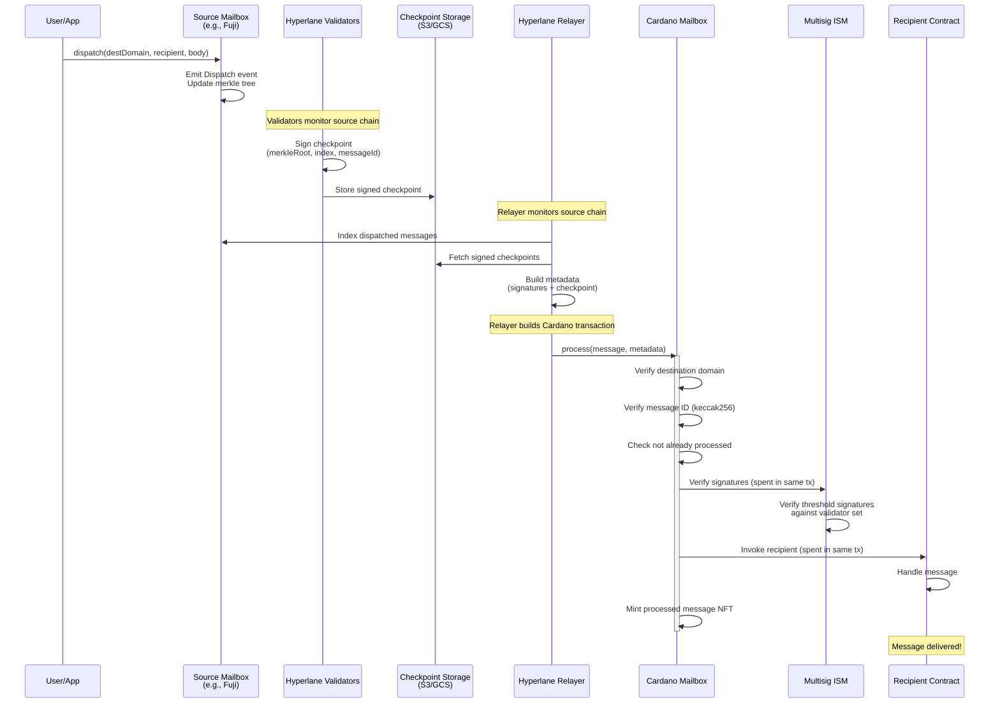

### Detailed Transaction Flow

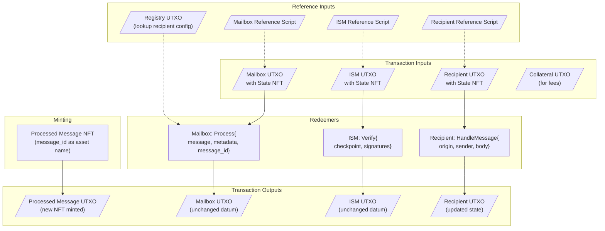

### Signature Verification Detail

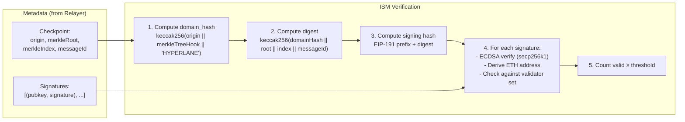

---

## Outgoing Message Flow (Cardano → Other Chains)

This flow describes how a message dispatched from Cardano reaches a recipient on another chain. **Note: This flow is implemented in contracts but not yet fully integrated with the validator agent.**

### High-Level Flow

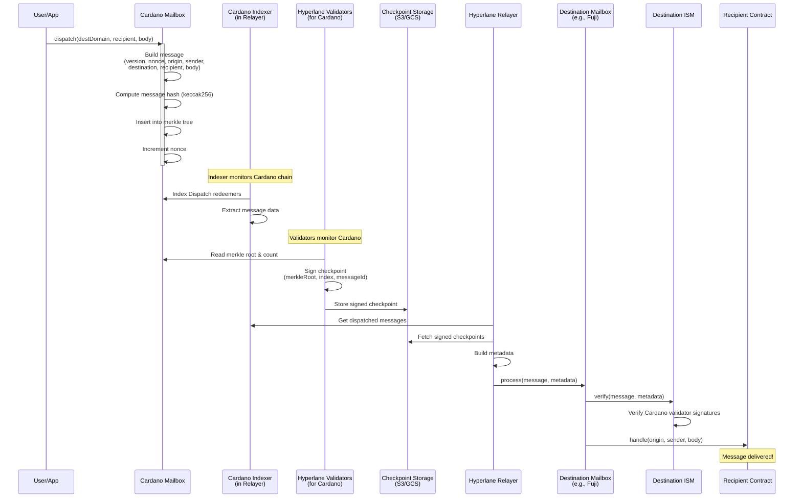

### Dispatch Transaction Structure

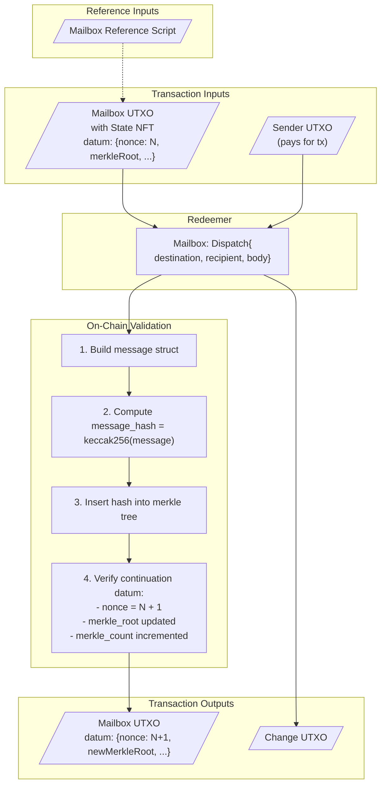

### Merkle Tree Updates

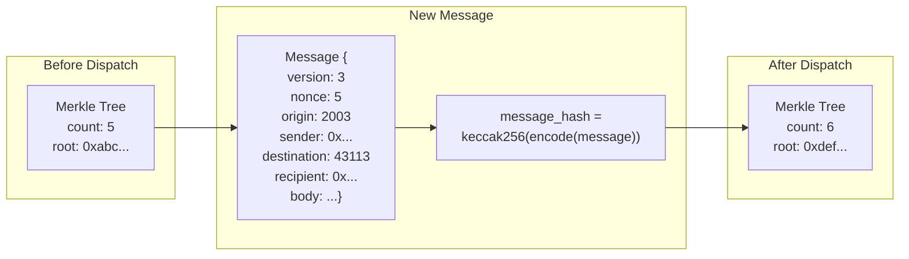

---

## NFT Usage Patterns

Cardano's eUTXO model requires different patterns than account-based chains. We use NFTs extensively to solve several challenges:

### 1. State UTXO Identification

**Problem**: UTXOs at a script address are not uniquely identifiable by address alone.

**Solution**: Each contract's state UTXO contains a unique "state NFT" that identifies it. This combines two well-known Cardano patterns:

- [One-Shot Minting Policy](https://aiken-lang.org/fundamentals/common-design-patterns#one-shot-minting-policies): The NFT can only be minted once (parameterized by a UTXO that must be consumed)
- [State Thread Token](https://aiken-lang.org/fundamentals/common-design-patterns#state-thread-token): The NFT identifies the "current" state UTXO as it moves through transactions

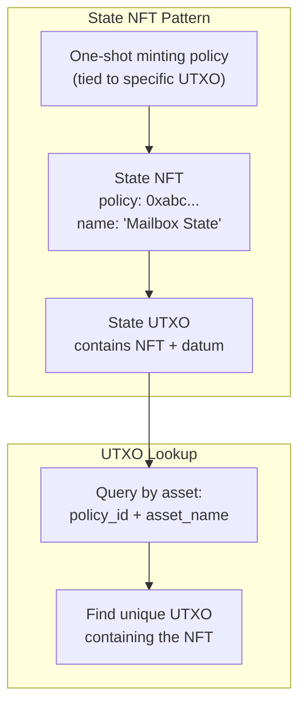

**Contracts using State NFTs:**
| Contract | NFT Purpose |
|----------|-------------|
| Mailbox | Identifies the single mailbox state UTXO |
| ISM | Identifies the ISM configuration UTXO |
| Registry | Identifies the recipient registry UTXO |
| Warp Route | Identifies each warp route's state UTXO |
| Vault | Identifies token vault UTXOs |
| Recipients | Each registered recipient has a state NFT |

### 2. Replay Protection (Processed Message NFTs)

**Problem**: Prevent the same message from being processed twice.

**Solution**: Mint a unique NFT for each processed message, using the message ID as the asset name.

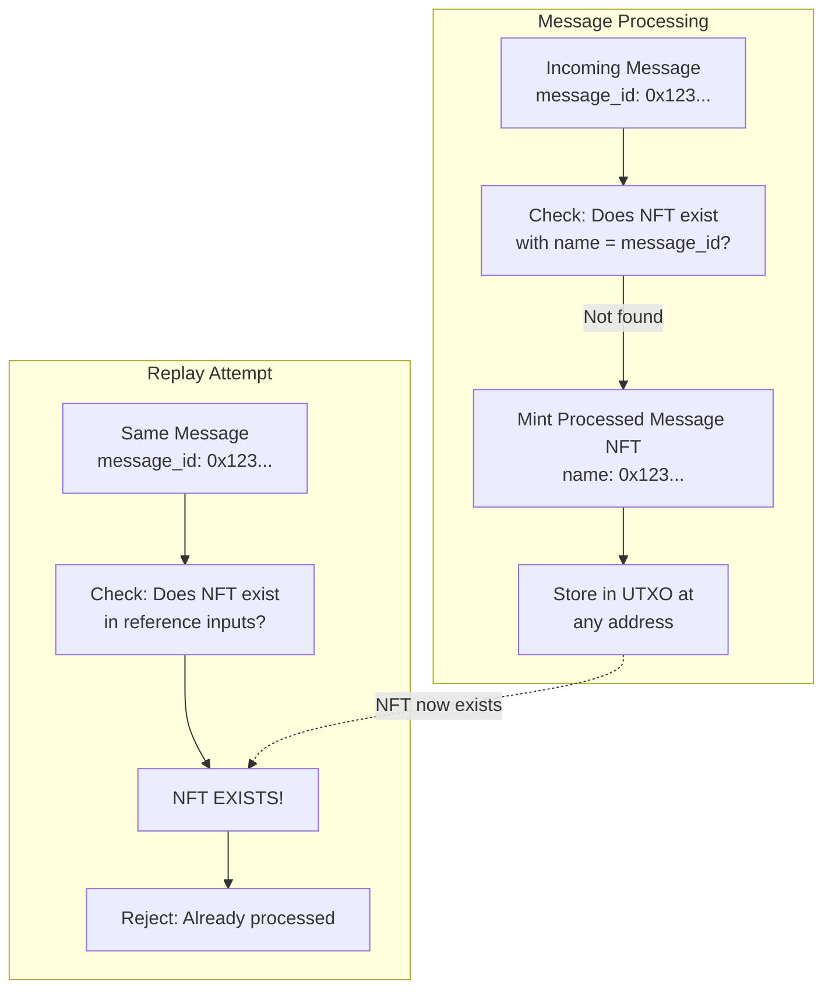

**Benefits:**
- O(1) lookup via Blockfrost asset query
- Immutable proof of processing
- No state bloat in mailbox datum
- **Upgrade-safe**: Policy ID remains stable across mailbox upgrades (see below)

**Why parameterized by `mailbox_policy_id` (not `mailbox_script_hash`)?**

The `processed_message_nft` minting policy is parameterized by `mailbox_policy_id` (the one-shot NFT policy that identifies the mailbox state UTXO) rather than `mailbox_script_hash`. This is critical for upgrade safety:

| Parameter | Stability | Effect on Replay Protection |
|-----------|-----------|----------------------------|
| `mailbox_script_hash` | Changes with every code update | ❌ Old NFTs under different policy, replay possible |
| `mailbox_policy_id` | Fixed at initialization | ✅ Same policy forever, replay protection maintained |

The `mailbox_policy_id` is determined once during mailbox initialization and never changes. This ensures that all processed message NFTs, regardless of when they were minted, are under the same policy and can be found during replay checks.

### 3. Message Authentication (Stored Message NFTs)

**Problem**: In deferred processing, prove that a stored message came from the mailbox.

**Solution**: The mailbox mints a "stored message NFT" that only it can create. The recipient verifies this NFT exists when processing.

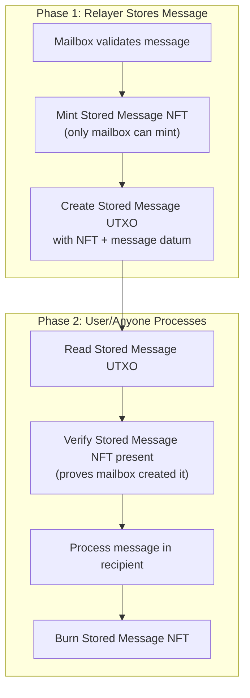

**Security Properties:**
- Only mailbox can mint the NFT (parameterized minting policy)
- NFT presence proves message authenticity
- Burning prevents double-processing

### 4. Recipient Registration Ownership

**Problem**: Prove ownership of a recipient script when registering/modifying.

**Solution**: The script must be spent in the same transaction as the registry update.

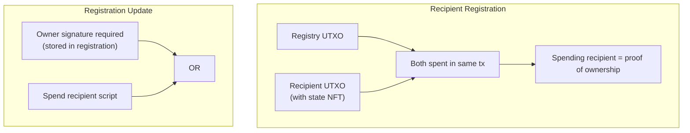

### NFT Summary Table

| NFT Type | Purpose | Minting Policy | When Minted | When Burned |
|----------|---------|----------------|-------------|-------------|
| State NFT | Identify state UTXOs | One-shot (tied to UTXO) | Contract deployment | Never |
| Processed Message NFT | Replay protection | Mailbox-controlled | Message processing | Never |
| Stored Message NFT | Message authentication | Mailbox-controlled | Deferred store | Deferred process |
| Synthetic Token | Bridged token representation | Warp route-controlled | Token receive | Token send |

---

## Contract Architecture

### Cross-Contract Coordination in eUTXO

Unlike account-based chains (EVM, Solana), Cardano does not support cross-contract calls. A contract cannot "invoke" another contract directly. Instead, all contracts in a transaction validate **independently and simultaneously** against the same transaction context.

We achieve cross-contract coordination through a pattern we call **"mutual spending validation"**: each contract checks that the other contracts it depends on are being spent in the same transaction.

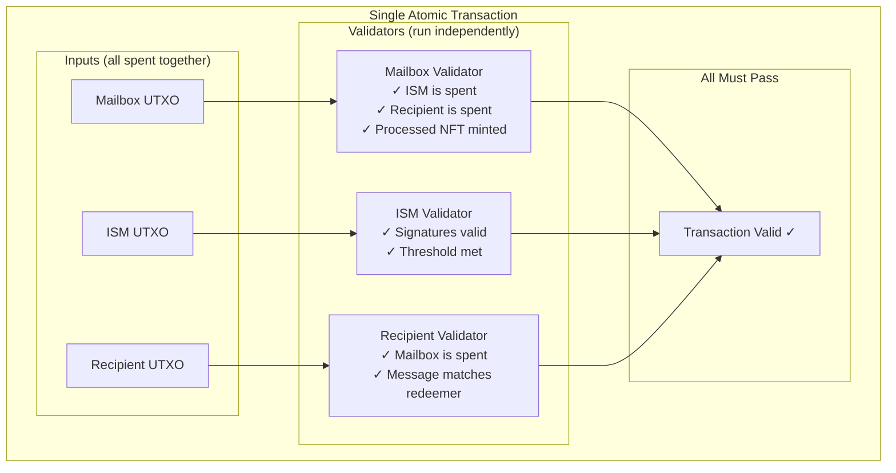

#### How Each Contract Ensures Correctness

**Mailbox ensures the TRUSTED ISM verifies THIS specific message:**

The mailbox performs two critical checks:
1. **Trust check**: Only an ISM with the exact script hash stored in `datum.default_ism` is accepted
2. **Message binding**: The ISM's redeemer must contain a checkpoint for THIS specific `message_id`

```aiken
// In mailbox.ak - verify_ism_for_message()
// 1. Get trusted ISM hash from mailbox datum (or recipient's custom ISM)
let ism_hash = get_recipient_ism(message.recipient, datum.default_ism, tx)

// 2. Find an input with that EXACT script hash (trust check)
// 3. Look up its redeemer from tx.redeemers
// 4. Parse it as MultisigIsmRedeemer
// 5. Verify checkpoint.message_id == expected_message_id (message binding)

list.any(tx.inputs, fn(input) {
    when input.output.address.payment_credential is {
        Script(hash) ->
            // CRITICAL: Only accept ISM with the exact trusted script hash
            if hash == ism_hash {
                verify_ism_redeemer_message_id(input.output_reference, message_id, tx)
            } else {
                False
            }
        _ -> False
    }
})
```

This prevents two attack vectors:
- **Untrusted ISM**: An attacker cannot use an arbitrary ISM contract
- **Signature replay**: An attacker cannot reuse valid signatures from a different message

**Recipient ensures message came from mailbox:**

The recipient checks that the mailbox UTXO (identified by its state NFT) is being spent in the same transaction. Since the mailbox validates the message and verifies the ISM redeemer, the recipient trusts the message is authentic.

```aiken
// In recipient - mailbox_is_caller()
let mailbox_spent = list.any(tx.inputs, fn(input) {
    // Check if input contains the mailbox state NFT
    let policy_tokens = tokens(input.output.value, mailbox_policy_id)
    !dict.is_empty(policy_tokens)
})
```

**Why this works:**
1. All validators in a transaction run against the **same transaction context**
2. If ANY validator fails, the **entire transaction fails**
3. By checking that required contracts are spent, we ensure their validators run
4. The mailbox **inspects the ISM's redeemer** to verify it's for the correct message
5. Each validator enforces its own invariants (ISM checks signatures, mailbox checks message binding, recipient checks mailbox presence)

This is fundamentally different from EVM where:
- Contract A calls Contract B, passing control flow
- Contract B can modify state and return values to A
- Execution is sequential

In Cardano:
- All contracts validate the same transaction simultaneously
- No control flow between contracts
- Coordination via "I see you're being spent, so I know your rules passed"

### Contract Dependency Graph

The arrows below represent "checks that X is spent" relationships, not invocations:

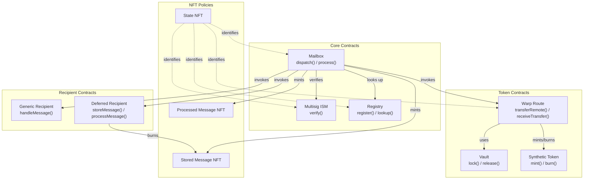

### Recipient Types

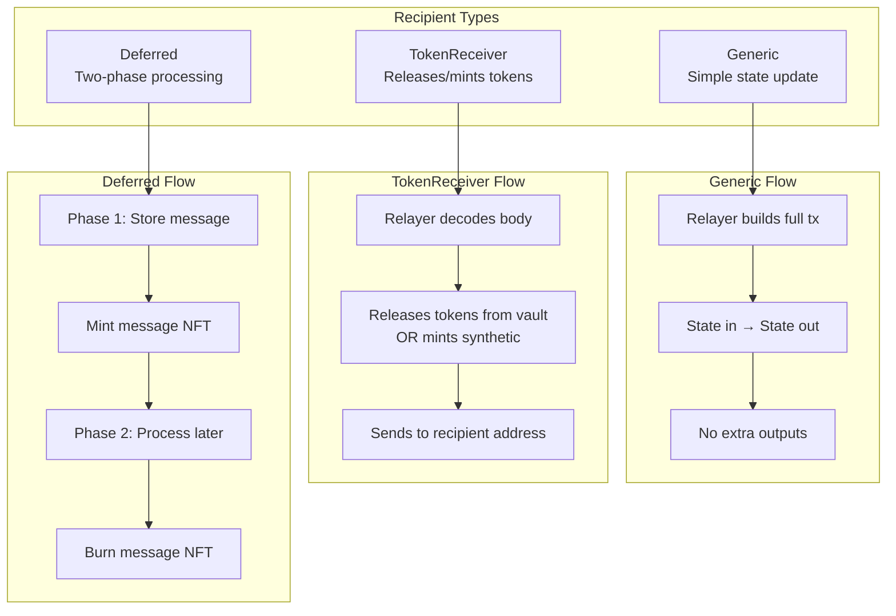

---

## Transaction Structure

### Reference Script Usage

To minimize transaction size, validator scripts are stored as reference scripts:

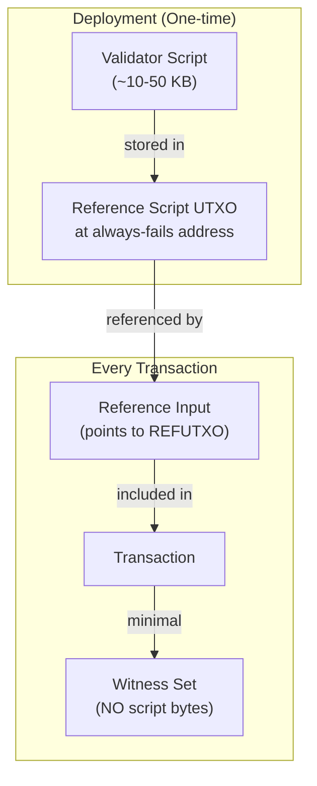

## Appendix: Domain and Address Encoding

### Hyperlane Address Format

Cardano script hashes (28 bytes) are padded to 32 bytes for Hyperlane compatibility:

```
Cardano Script Hash: 0x1234567890abcdef... (28 bytes)
Hyperlane Address:   0x020000001234567890abcdef... (32 bytes)
                       ^^^^^^^^
                       Prefix: 0x02000000 = Script credential
```

### Domain IDs

| Chain | Domain ID |
|-------|-----------|
| Cardano Preview | 2003 |
| Fuji (Avalanche) | 43113 |
| Ethereum Mainnet | 1 |
| Ethereum Sepolia | 11155111 |

---

*Last Updated: December 2024*
